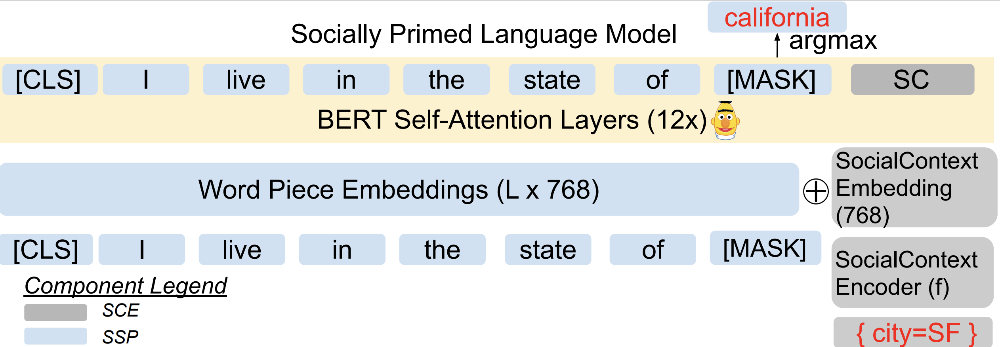

# LMSOC - Code for LMSOC

[](https://colab.research.google.com/github/twitter-research/lmsoc) [](https://mybinder.org/v2/gh/twitter-research/lmsoc/HEAD)




## Citation

Please cite as:

> Kulkarni, V., Mishra, S., & Haghighi, A. (2021). LMSOC: An Approach for Socially Sensitive Pretraining. Proceedings of the 2021 Conference on Empirical Methods in Natural Language Processing: Findings.


```bibtex
@inproceedings{kulkarni2021lmsoc,
  title={LMSOC: An Approach for Socially Sensitive Pretraining},
  author={Kulkarni, Vivek and Mishra, Shubhanshu and Haghighi, Aria},
  booktitle={Proceedings of the 2021 Conference on Empirical Methods in Natural Language Processing: Findings},
  year={2021}
}
```

## Reproducibility

NOTE: Dependencies are specified in the notebooks. But we have also encluded an `requirements.txt` and `environment.yml` files to install dependencies using pip or conda. 

* Create Social Context Embeddings via the example notebook `embed_time_toy_task.ipynb` which contains the implementation of how to embed time for Task 1 in the paper.
* Upload the files in `data/` to the location where you will run the next notebook. 
* The notebook `lmsoc_train_and_eval_toy_task.ipynb` contains the LMSOC training code. 
  * **NOTE:** This notebook assumes you have already trained social context embeddings for the data you have (for example, here the social context is time).
  * It is a runnable colab notebook which demonstrates the entire process of training and evaluating LMSOC as described in the paper. 
  * If run, it will reproduce the experimental setup for Task 1 and ultimately yield Figure 2. 
  * In order to run this notebook in colab, open this notebook in Google Colab and upload the files in "data" directory to your colab workspace. 


# Security Issues?

Please report sensitive security issues via Twitter's bug-bounty program (https://hackerone.com/twitter) rather than GitHub.
